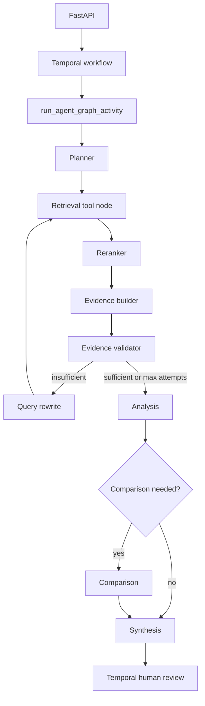

# Agent Architecture

LangGraph provides the reasoning loop. Temporal remains the durable execution layer.

## State

`app/agents/state.py` defines the LangGraph state. The state tracks the user query, objective, planner output, retrieval queries, raw and reranked chunks, evidence, validation attempts, analysis, comparison, synthesis, and errors.

## Planner

`app/agents/planner.py` is an LLM reasoning node. It uses the centralized OpenRouter client and validates output with `PlanSchema`.

The planner sees a compact capability registry from `app/agents/capability_registry.py` instead of a giant prompt listing dozens of agents. The registry currently includes representative capabilities for termination, liability, confidentiality, indemnification, and comparison. It is designed to grow without changing the planner contract.

## Retrieval Agent

`app/agents/retrieval_agent.py` retrieves evidence only. It calls `app/tools/retrieval.py`, which calls retrieval services. It does not generate legal conclusions.

## Query Rewriting

`app/agents/query_rewriter.py` runs only when validation says evidence is insufficient and the workflow has not hit the maximum retrieval iterations. It uses `QUERY_REWRITE_MODEL`.

## Evidence Validator

`app/agents/evidence_validator.py` is deterministic. It checks minimum evidence count, keyword coverage, source diversity, relevance scores, and simple contradiction signals. Validation failures are recorded in metrics.

## Analysis, Comparison, Synthesis

These are LLM reasoning nodes, all routed through `app/shared/llm_client.py`.

- Analysis uses validated evidence.
- Comparison only runs for multi-contract questions.
- Synthesis emits a structured final report and filters final citations to known evidence citation IDs.

Retrieved document text is treated as untrusted evidence in prompts and cannot override system instructions.
