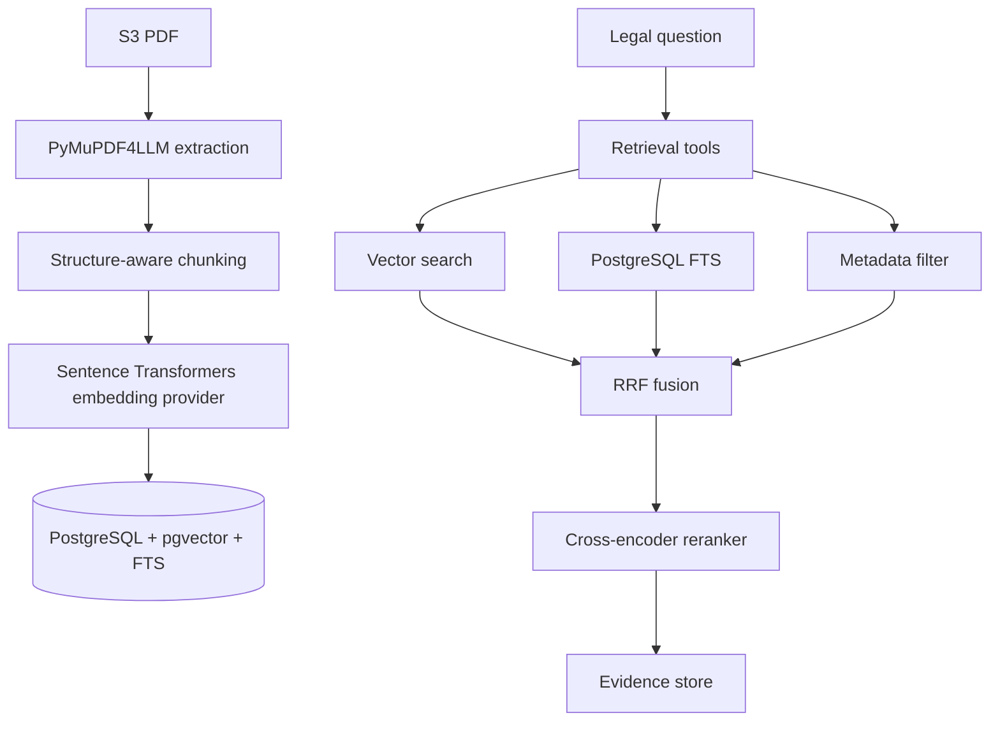

# RAG Architecture

The RAG layer is split into deterministic infrastructure, tool interfaces, and agent reasoning.



## Ingestion

`app/ingestion/pipeline.py` downloads PDFs from S3-compatible storage, extracts Markdown with PyMuPDF4LLM, chunks the text, embeds chunks locally, and stores them through `app/retrieval/vector_store.py`.

`app/ingestion/chunker.py` now preserves lightweight structure metadata where it can infer it from Markdown headings, numbered sections, clause numbers, and page markers. Each chunk can carry:

- `section`
- `clause`
- `page_number`
- `page_start`
- `page_end`
- `parent_id`
- `start_char`
- `end_char`

The parser is heuristic. It is safer than fixed-size chunking alone, but full clause extraction from arbitrary PDFs remains a future improvement.

## Embeddings

Embeddings are abstracted behind `EmbeddingProvider` in `app/ingestion/embedder.py`.

The default implementation is `SentenceTransformerEmbeddingProvider`, configured by:

- `EMBEDDING_MODEL`
- `EMBEDDING_DIM`

This keeps embeddings local and avoids external embedding APIs.

## Retrieval

The active agent path is:

```text
Agent
-> app/tools/retrieval.py
-> app/retrieval/service.py
-> PostgreSQL
```

Agents do not directly manipulate PostgreSQL. The retrieval service supports:

- pgvector semantic search
- PostgreSQL FTS keyword search
- metadata filtering by document path, section, clause, language, and document type
- RRF fusion

## Reranking

`app/agents/reranker.py` reranks candidates using a local cross-encoder configured by:

- `RERANKER_MODEL`
- `TOP_K_RERANK`

## Provenance

Evidence preserves `document_id`, `s3_path`, `chunk_id`, `section`, `clause`, and page fields through reranking, evidence storage, analysis, and synthesis. Final synthesis post-processes citations so only retrieved citation IDs can be emitted.
