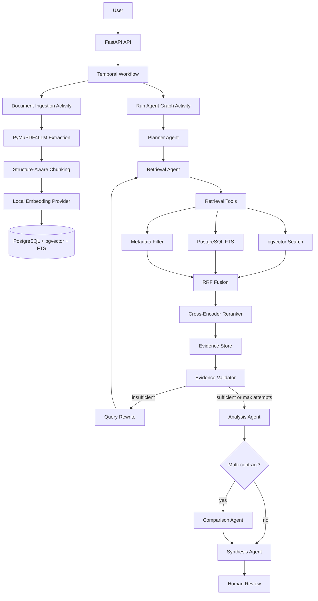

# Agentic Legal RAG System

A production-oriented contract intelligence platform that combines durable workflow orchestration, agentic retrieval-augmented generation, hybrid search, local embeddings/reranking, and evidence-grounded legal analysis.

The system is designed for legal and procurement teams that need to ask questions across one or many contracts while preserving source provenance. It avoids sending entire PDFs blindly to an LLM. Instead, it ingests documents into a searchable evidence store, retrieves relevant clauses, validates evidence, and only then asks LLM-based agents to analyze and synthesize.

## What This Project Does

This project transforms contract review from a simple "extract PDF and summarize everything" flow into an Agentic RAG workflow:

```text
FastAPI
-> Temporal workflow
-> LangGraph agent runtime
-> Planner
-> Hybrid retrieval tools
-> Reranker
-> Evidence store
-> Evidence validator
-> Analysis and comparison agents
-> Evidence-grounded synthesis
-> Durable human review
```

The core promise is simple: legal conclusions should be traceable to contract evidence. If evidence is missing, the system should say so rather than inventing support.

## Current Capabilities

- PDF ingestion from S3-compatible storage.
- PDF-to-Markdown extraction with PyMuPDF4LLM.
- Structure-aware chunking with inferred section, clause, page, and parent metadata.
- Local Sentence Transformers embeddings.
- PostgreSQL storage with pgvector support.
- PostgreSQL full-text search.
- Hybrid retrieval using vector search, FTS, metadata filtering, and reciprocal rank fusion.
- Local cross-encoder reranking.
- LangGraph planner, retrieval, validation, analysis, comparison, and synthesis flow.
- Query rewriting when evidence validation fails.
- Planner-selected analysis capabilities for clause-specific reasoning.
- Persistence of agent evidence, citations, and analysis results.
- Centralized OpenRouter LLM client using the OpenAI-compatible SDK.
- Configurable model routing for planner, rewrite, validator, analysis, and synthesis tasks.
- Temporal workflows for durable execution and human-in-the-loop review.
- Prometheus, OpenTelemetry, Loki, Jaeger, Grafana, and structlog observability.
- Local evaluation primitives for retrieval and generation quality.

## Architecture Principles

The system intentionally separates responsibilities into three layers.

### Layer A: Deterministic Infrastructure

These components do not use LLM reasoning:

- Temporal workflow execution
- PostgreSQL and pgvector
- PostgreSQL full-text search
- S3-compatible storage
- PDF extraction
- chunking
- embedding generation
- reranking
- metadata filtering
- evidence accumulation
- heuristic evidence validation
- logging, metrics, and tracing

This keeps the core retrieval and persistence behavior testable and reproducible.

### Layer B: Agentic Reasoning

LangGraph is used for reasoning and state transitions:

- planning
- deciding retrieval focus
- deciding whether comparison is needed
- validating whether evidence is sufficient
- rewriting retrieval queries when evidence is weak
- selecting analysis focus
- synthesizing final reports

LangGraph is not used as a durable workflow engine. It runs inside Temporal activities.

### Layer C: LLM Inference

All LLM calls go through:

[app/shared/llm_client.py](app/shared/llm_client.py)

The project uses OpenRouter through the OpenAI-compatible async SDK. Individual agents do not instantiate provider SDKs directly. This gives one place for:

- API gateway configuration
- model routing
- token accounting
- cost tracking
- JSON repair
- structured output validation

No Ollama or local LLM server is required.

## System Diagram



## Why These Technologies

| Technology | Role | Why it is used |
|---|---|---|
| FastAPI | HTTP API | Async Python API layer with Pydantic request validation and simple operational ergonomics. |
| Temporal | Durable workflow engine | Contract review is long-running, failure-prone, and may wait for human review. Temporal gives retries, timeouts, signals, updates, queries, and durable state. |
| LangGraph | Agentic state machine | Agent reasoning needs explicit state, conditional transitions, retrieval loops, and controlled graph execution. |
| OpenRouter | LLM gateway | One OpenAI-compatible gateway for model choice, routing, and cost management. |
| PostgreSQL | Primary storage | Stores documents, chunks, metadata, and search structures in one operational database. |
| pgvector | Vector retrieval | Enables semantic search directly inside PostgreSQL. |
| PostgreSQL FTS | Lexical retrieval | Legal queries often depend on exact terms such as "termination", "indemnity", or "liability cap". |
| Sentence Transformers | Local embeddings | Avoids external embedding API cost and keeps embeddings configurable. |
| CrossEncoder reranker | Relevance reranking | Improves evidence precision after broad hybrid retrieval. |
| PyMuPDF4LLM | PDF extraction | Produces Markdown-like document text suitable for structural chunking. |
| Prometheus | Metrics | Tracks workflows, activities, LLM calls, retrieval, evidence validation, and agent behavior. |
| OpenTelemetry + Jaeger | Tracing | Follows a request through API, Temporal, LangGraph, retrieval, LLM, and synthesis. |
| Loki + structlog | Logs | Structured JSON logs with correlation IDs and workflow metadata. |
| Grafana | Dashboards | Visualizes metrics, traces, logs, and business health. |

## Repository Layout

```text
agentic-legal-rag-system/
├── app/
│   ├── agents/
│   │   ├── graph.py                    # LangGraph graph wiring
│   │   ├── state.py                    # typed graph state and dataclasses
│   │   ├── planner.py                  # LLM planner
│   │   ├── query_rewriter.py           # retrieval-loop query rewrite
│   │   ├── retrieval_agent.py          # retrieval node using tool layer
│   │   ├── infrastructure_nodes.py     # rerank, evidence build, validation
│   │   ├── analysis_agent.py           # evidence-grounded legal analysis
│   │   ├── analysis_capabilities.py    # planner-selected analysis instructions
│   │   ├── comparison_agent.py         # cross-contract comparison
│   │   ├── synthesis_node.py           # final structured report
│   │   ├── capability_registry.py      # scalable agent capability registry
│   │   ├── schemas.py                  # Pydantic schemas for structured outputs
│   │   ├── evidence_store.py           # citation and evidence accumulator
│   │   ├── evidence_validator.py       # deterministic evidence checks
│   │   ├── activities.py               # Temporal activities for agent/RAG flow
│   │   ├── ingest_workflow.py          # Temporal document ingestion workflow
│   │   └── review_workflow.py          # Temporal agent review workflow
│   │
│   ├── client_app/
│   │   ├── main.py                     # FastAPI app and endpoints
│   │   └── requirements.txt
│   │
│   ├── ai_contract_review/
│   │   ├── worker.py                   # Temporal worker registration
│   │   ├── parent_worker.py            # legacy parent contract workflow
│   │   ├── child_worker.py             # legacy per-contract child workflow
│   │   ├── activities.py               # legacy extraction/LLM activities
│   │   ├── prompts.py
│   │   └── requirements.txt
│   │
│   ├── ingestion/
│   │   ├── chunker.py                  # structure-aware Markdown chunker
│   │   ├── embedder.py                 # EmbeddingProvider and local implementation
│   │   └── pipeline.py                 # S3 PDF -> chunks -> embeddings -> DB
│   │
│   ├── retrieval/
│   │   ├── service.py                  # retrieval service used by tools
│   │   ├── vector_store.py             # storage and lower-level search helpers
│   │   └── hybrid_search.py            # earlier two-source hybrid search helper
│   │
│   ├── tools/
│   │   └── retrieval.py                # agent-facing retrieval tools
│   │
│   ├── shared/
│   │   ├── config.py                   # centralized configuration dataclasses
│   │   ├── database.py                 # SQLAlchemy models and DB init
│   │   ├── llm_client.py               # centralized OpenRouter LLM client
│   │   ├── s3.py                       # S3 URI/client helpers
│   │   └── observability/              # metrics, tracing, logging, middleware
│   │
│   ├── repositories/
│   │   └── review_results.py           # persistence for evidence/results/citations
│   │
│   └── evaluation/
│       ├── retrieval.py                # Recall@K, Precision@K, MRR, NDCG
│       ├── generation.py               # citation correctness, groundedness
│       ├── run_evaluation.py           # saved-output evaluation runner
│       └── datasets/
│
├── samples-server/compose/             # Docker Compose infrastructure
├── tests/                              # unit tests
├── README.md                           # this file
├── RUN.md                              # detailed local runbook
├── ARCHITECTURE.md                     # extended architecture reference
├── RAG.md                              # RAG-specific design
├── AGENTS.md                           # agent flow and state design
├── EVALUATION.md                       # evaluation design
└── OBSERVABILITY.md                    # observability reference
```

## Main Workflows

### Document Ingestion

```text
S3 PDF
-> download to temp storage
-> PyMuPDF4LLM extraction
-> Markdown text
-> structure-aware chunking
-> local embeddings
-> PostgreSQL documents/chunks tables
-> pgvector and FTS searchable evidence
```

The ingestion path stores chunk-level provenance. The target citation fields are:

- document ID
- S3 path
- chunk ID
- section
- clause
- page number
- page start/end
- source tool
- retrieval/rerank score

### Agentic Review

```text
User query
-> planner creates objective, subqueries, capabilities, comparison flag
-> retrieval agent calls hybrid retrieval tools
-> candidates are fused and reranked
-> evidence is accumulated and validated
-> weak evidence triggers query rewriting and another retrieval pass
-> analysis agent produces cited legal findings
-> comparison agent runs when multiple contracts are in scope
-> synthesis agent produces a structured final report
-> Temporal waits for human approval or revision
```

Maximum retrieval iterations are controlled by `MAX_RETRIEVAL_ITERATIONS`.

### Human Review

Human review is implemented with Temporal workflow signals, updates, and queries. It is durable, so the application can wait for review without holding an in-memory request open.

Review decisions:

- assign reviewer
- approve report
- request revision with feedback

On revision, the workflow reruns the agent graph with the reviewer feedback included in the query context.

## API Overview

### Health

```http
GET /health
```

### Ingest Document

```http
POST /ingest
```

```json
{
  "s3_path": "s3://temporal/vendor-service-agreement.pdf",
  "batch_size": 2,
  "max_chunk_tokens": 512
}
```

### Start Agentic RAG Review

```http
POST /agent-review/start
```

```json
{
  "query": "Which contracts allow unilateral termination with less than 30 days notice?",
  "s3_paths": [
    "s3://temporal/vendor-service-agreement.pdf",
    "s3://temporal/nda-innovate-consultpro.pdf",
    "s3://temporal/software-license-globalsoft.pdf"
  ],
  "top_k": 8
}
```

### Query Agentic Review

```http
GET /agent-review/{workflow_id}/status
GET /agent-review/{workflow_id}/report
```

### Legacy Contract Review

```http
POST /contract-review/start
GET /contract-review/{workflow_id}/status
GET /contract-review/{workflow_id}/report
POST /contract-review/{workflow_id}/post_reviewer
POST /contract-review/{workflow_id}/revise
POST /contract-review/{workflow_id}/approve
```

## Configuration

The main environment variables are defined in [.env.example](.env.example).

Important groups:

- Temporal: `TEMPORAL_HOST`, `TEMPORAL_NAMESPACE`, task queues.
- Storage: `AWS_ACCESS_KEY_ID`, `AWS_SECRET_ACCESS_KEY`, `AWS_REGION`, `AWS_S3_ENDPOINT_URL`, `S3_BUCKET`.
- Database: `DATABASE_URL`, `DATABASE_SYNC_URL`, `DB_POOL_SIZE`, `EMBEDDING_DIM`.
- LLM: `OPENROUTER_API_KEY`, `LLM_BASE_URL`, `LLM_MODEL_NAME`, token prices.
- Model routing: `PLANNER_MODEL`, `QUERY_REWRITE_MODEL`, `VALIDATOR_MODEL`, `ANALYSIS_MODEL`, `SYNTHESIS_MODEL`.
- RAG: `EMBEDDING_MODEL`, `RERANKER_MODEL`, `TOP_K_RETRIEVAL`, `TOP_K_RERANK`, `MAX_RETRIEVAL_ITERATIONS`.
- Observability: `OTEL_ENDPOINT`, `LOKI_URL`, `APP_NAME`, `ENVIRONMENT`, metrics ports.

## Observability

The system exposes and records:

- workflow started/completed/failed counts
- workflow duration
- activity duration and failures
- LLM request count, duration, tokens, and estimated cost
- document ingestion and chunk counts
- RAG search request count, latency, and result counts
- retrieval iteration counts
- evidence validation failures
- agent execution and latency metrics
- human review approvals, revisions, and timeouts

Operational dashboards are documented in [OBSERVABILITY.md](OBSERVABILITY.md).

## Evaluation

The initial evaluation framework is local and deterministic:

- retrieval metrics in [app/evaluation/retrieval.py](app/evaluation/retrieval.py)
- generation/citation metrics in [app/evaluation/generation.py](app/evaluation/generation.py)
- saved-output runner in [app/evaluation/run_evaluation.py](app/evaluation/run_evaluation.py)
- golden examples in [app/evaluation/datasets/golden_contract_questions.jsonl](app/evaluation/datasets/golden_contract_questions.jsonl)

It evaluates saved retrieval/report outputs rather than bootstrapping the full Temporal and database stack.

## Documentation Map

- [RUN.md](RUN.md) — detailed setup and run instructions.
- [ARCHITECTURE.md](ARCHITECTURE.md) — deeper architecture and technology reference.
- [RAG.md](RAG.md) — ingestion, retrieval, reranking, and evidence provenance.
- [AGENTS.md](AGENTS.md) — LangGraph state, planner, capability registry, retrieval loop, and synthesis.
- [EVALUATION.md](EVALUATION.md) — evaluation metrics and dataset format.
- [OBSERVABILITY.md](OBSERVABILITY.md) — metrics, logs, traces, and dashboards.
- [TESTING.md](TESTING.md) — testing strategy and examples.

## Current Limitations

- The structure-aware chunker infers sections and clauses heuristically from Markdown. It is useful, but it is not a full legal clause parser.
- End-to-end execution requires PostgreSQL/pgvector, Temporal, S3-compatible storage, OpenRouter credentials, and installed Python dependencies.
- Evaluation has deterministic metrics, seed data, and a saved-output runner, but not yet a one-command E2E stack runner.
- Some legacy PDF extraction modules remain for backward compatibility.

## License

Internal project. Not licensed for external distribution unless a license is added.
